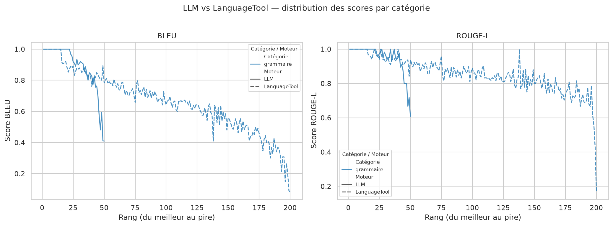

# Rapport d'évaluation — Correction grammaticale (français)

_Généré le 29/06/2026 à 18:16_

## Tableau comparatif global

| Moteur       | N   | BLEU moy. | ROUGE-L moy. | BLEU min | ROUGE-L min | Score moy. |
| ------------ | --- | --------- | ------------ | -------- | ----------- | ---------- |
| LLM          | 50  | 0.8859    | 0.9484       | 0.4091   | 0.6087      | 0.9171     |
| LanguageTool | 200 | 0.6627    | 0.8530       | 0.0817   | 0.1667      | 0.7578     |

## Par catégorie

| Catégorie | Moteur       | N   | BLEU moy. | ROUGE-L moy. | Score moy. |
| --------- | ------------ | --- | --------- | ------------ | ---------- |
| grammaire | LLM          | 50  | 0.8859    | 0.9484       | 0.9171     |
| grammaire | LanguageTool | 200 | 0.6627    | 0.8530       | 0.7578     |

## Graphique comparatif

## Pires exemples — LLM (N=5)

### #1 · score=0.5089  BLEU=0.4091  ROUGE-L=0.6087  [grammaire]
**Entrée :**   Qu’est-ce qu’on a gagné avec le projet de loi 0? C’ezt uoi lesavantages qu’on a das le rséeau scolaire?
**Sortie :**   Qu’avons-nous gagné avec le projet de loi n° 0 ? Quels sont les avantages dans le réseau scolaire ?
**Référence:** Qu’est-ce qu’on a gagné avec le projet de loi 40? C’est quoi les avantages qu’on a dans le réseau scolaire?

### #2 · score=0.5643  BLEU=0.4107  ROUGE-L=0.7179  [grammaire]
**Entrée :**   On estencore loin de voir émerger des cortèges CGT youtubeurs, Solidaires tiktokeurs ou CFDT streameurs.
**Sortie :**   On est encore loin de voir émerger des cortèges de youtubeurs CGT, de tiktokeurs Solidaires ou de streameurs de la CFDT.
**Référence:** On est encore loin de voir émerger des cortèges CGT youtubeurs, Solidaires tiktokeurs ou CFDT streameurs.

### #3 · score=0.6306  BLEU=0.5946  ROUGE-L=0.6667  [grammaire]
**Entrée :**   Quee des Dominicians.
**Sortie :**   Quai des Dominicains.
**Référence:** Que des Dominicains.

### #4 · score=0.6404  BLEU=0.4809  ROUGE-L=0.8000  [grammaire]
**Entrée :**   Le comité avait révoqué l’élection d’Henrique SchneideSr par souci de perte de réputation et ee crédibilité, avait-il…
**Sortie :**   Le comité avait révoqué l’élection d’Henrique Schneide Sr par souci de préserver la réputation et la crédibilité,…
**Référence:** Le comité avait révoqué l’élection d’Henrique Schneider par souci de perte de réputation et de crédibilité, avait-il…

### #5 · score=0.6841  BLEU=0.5681  ROUGE-L=0.8000  [grammaire]
**Entrée :**   La Ruelle dses artisans, l’an dernier, à son premier éyé à Campbellton.
**Sortie :**   La Ruelle des artisans, l’an dernier, a organisé son premier événement à Campbellton.
**Référence:** La Ruelle des artisans, l’an dernier, à son premier été à Campbellton.

## Pires exemples — LanguageTool (N=5)

### #1 · score=0.1242  BLEU=0.0817  ROUGE-L=0.1667  [grammaire]
**Entrée :**   Le doom pafrfaitpour zhi VAGO.
**Sortie :**   Le d'OGM pafrfaitpour chi VIGO.
**Référence:** Le doom parfait pour zhi VAGO.

### #2 · score=0.2595  BLEU=0.0904  ROUGE-L=0.4286  [grammaire]
**Entrée :**   Nous ’avons aiidé sur leterrin.
**Sortie :**   Nous ’avons aide sur l'utérin.
**Référence:** Nous l’avons aidé sur le terrain.

### #3 · score=0.3786  BLEU=0.2016  ROUGE-L=0.5556  [grammaire]
**Entrée :**   Sa valeur marchande estde ,650 millions d’euros.
**Sortie :**   Sa valeur marchande este, 650 millions dam™euros.
**Référence:** Sa valeur marchande est de 6,50 millions d’euros.

### #4 · score=0.4409  BLEU=0.2665  ROUGE-L=0.6154  [grammaire]
**Entrée :**   LaN3J va enfin vior le jour.
**Sortie :**   Lance va enfin Viaur le jour.
**Référence:** La N3J va enfin voir le jour.

### #5 · score=0.4691  BLEU=0.1488  ROUGE-L=0.7895  [grammaire]
**Entrée :**   Il a seulement pliadé coupable à ’accusation d’avoir proférédes menaces àà l’endroit de za mère.
**Sortie :**   Il a seulement plaide coupable à ’accusation d’avoir proférées menaces aA l’endroit de ZA mère.
**Référence:** Il a seulement plaidé coupable à l’accusation d’avoir proféré des menaces à l’endroit de sa mère.
