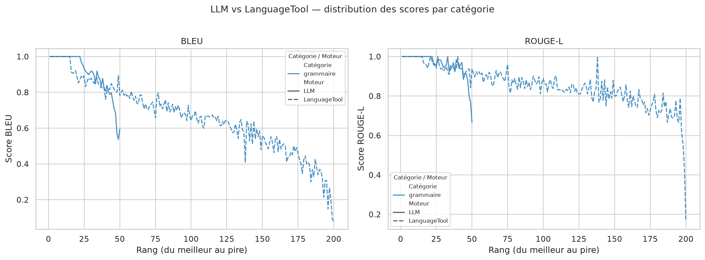

# Rapport d'évaluation — Correction grammaticale (français)

_Généré le 29/06/2026 à 18:53_

## Comment lire ce rapport

Tous les scores sont compris entre **0.0** (aucune ressemblance avec la référence) et **1.0** (correspondance parfaite). Ils mesurent à quel point la sortie du moteur reproduit fidèlement la phrase de référence corrigée.

### BLEU

Mesure le **chevauchement de n-grammes** (séquences de 1 à 4 mots consécutifs) entre la sortie et la référence. Il est très sensible à l'ordre des mots et aux formulations exactes. Un moteur qui paraphrase ou reformule — même correctement — sera pénalisé si la référence ne le fait pas. Un score BLEU < 0.5 signale en général des erreurs résiduelles importantes ou une sur-correction stylistique.

### ROUGE-L

Mesure la **plus longue sous-séquence commune** (LCS) entre la sortie et la référence. Plus souple que BLEU : il tolère les réordonnancements et les insertions mineures. ROUGE-L élevé avec BLEU faible indique un contenu globalement bien conservé mais avec des variantes de formulation.

### Score composite

Simple moyenne arithmétique **(BLEU + ROUGE-L) / 2**. Utilisé comme indicateur synthétique pour classer les exemples du meilleur au pire.

### Seuils indicatifs

| Score | Interprétation |
| ----- | -------------- |
| ≥ 0.90 | Correction quasi-parfaite, très proche de la référence |
| 0.70 – 0.89 | Bonne correction, variantes mineures de formulation |
| 0.50 – 0.69 | Correction partielle ou style modifié significativement |
| < 0.50 | Erreurs résiduelles importantes ou sur-correction |

## Tableau comparatif global

| Moteur       | N   | BLEU moy. | ROUGE-L moy. | BLEU min | ROUGE-L min | Score moy. |
| ------------ | --- | --------- | ------------ | -------- | ----------- | ---------- |
| LLM          | 50  | 0.9032    | 0.9602       | 0.5371   | 0.6667      | 0.9317     |
| LanguageTool | 200 | 0.6627    | 0.8530       | 0.0817   | 0.1667      | 0.7578     |

## Par catégorie

| Catégorie | Moteur       | N   | BLEU moy. | ROUGE-L moy. | Score moy. |
| --------- | ------------ | --- | --------- | ------------ | ---------- |
| grammaire | LLM          | 50  | 0.9032    | 0.9602       | 0.9317     |
| grammaire | LanguageTool | 200 | 0.6627    | 0.8530       | 0.7578     |

## Graphique comparatif

## Pires exemples — LLM (N=5)

### #1 · score=0.6306  BLEU=0.5946  ROUGE-L=0.6667  [grammaire]
**Entrée :**   Quee des Dominicians.
**Sortie :**   Quai des Dominicains.
**Référence:** Que des Dominicains.

### #2 · score=0.6531  BLEU=0.5371  ROUGE-L=0.7692  [grammaire]
**Entrée :**   Qu’est-ce qu’on a gagné avec le projet de loi 0? C’ezt uoi lesavantages qu’on a das le rséeau scolaire?
**Sortie :**   Qu’est-ce qu’on a gagné avec le projet de loi 0 ? Quels sont les avantages que l’on obtient dans le réseau scolaire ?
**Référence:** Qu’est-ce qu’on a gagné avec le projet de loi 40? C’est quoi les avantages qu’on a dans le réseau scolaire?

### #3 · score=0.6841  BLEU=0.5681  ROUGE-L=0.8000  [grammaire]
**Entrée :**   La Ruelle dses artisans, l’an dernier, à son premier éyé à Campbellton.
**Sortie :**   La Ruelle des artisans, l’an dernier, a eu son premier événement à Campbellton.
**Référence:** La Ruelle des artisans, l’an dernier, à son premier été à Campbellton.

### #4 · score=0.7824  BLEU=0.6848  ROUGE-L=0.8800  [grammaire]
**Entrée :**   Le comité avait révoqué l’élection d’Henrique SchneideSr par souci de perte de réputation et ee crédibilité, avait-il…
**Sortie :**   Le comité avait révoqué l’élection d’Henrique Schneider Sr. par crainte d'une perte de réputation et de crédibilité,…
**Référence:** Le comité avait révoqué l’élection d’Henrique Schneider par souci de perte de réputation et de crédibilité, avait-il…

### #5 · score=0.8116  BLEU=0.7102  ROUGE-L=0.9130  [grammaire]
**Entrée :**   Pour tous les types dde bios comme les plinthes,les moulures, écrasez légèrement la pointe du clou avec le marteau.
**Sortie :**   Pour tous les types de bois, tels que les plinthes et les moulures, écrasez légèrement la pointe du clou avec le…
**Référence:** Pour tous les types de bois comme les plinthes, les moulures, écrasez légèrement la pointe du clou avec le marteau.

## Pires exemples — LanguageTool (N=5)

### #1 · score=0.1242  BLEU=0.0817  ROUGE-L=0.1667  [grammaire]
**Entrée :**   Le doom pafrfaitpour zhi VAGO.
**Sortie :**   Le d'OGM pafrfaitpour chi VIGO.
**Référence:** Le doom parfait pour zhi VAGO.

### #2 · score=0.2595  BLEU=0.0904  ROUGE-L=0.4286  [grammaire]
**Entrée :**   Nous ’avons aiidé sur leterrin.
**Sortie :**   Nous ’avons aide sur l'utérin.
**Référence:** Nous l’avons aidé sur le terrain.

### #3 · score=0.3786  BLEU=0.2016  ROUGE-L=0.5556  [grammaire]
**Entrée :**   Sa valeur marchande estde ,650 millions d’euros.
**Sortie :**   Sa valeur marchande este, 650 millions dam™euros.
**Référence:** Sa valeur marchande est de 6,50 millions d’euros.

### #4 · score=0.4409  BLEU=0.2665  ROUGE-L=0.6154  [grammaire]
**Entrée :**   LaN3J va enfin vior le jour.
**Sortie :**   Lance va enfin Viaur le jour.
**Référence:** La N3J va enfin voir le jour.

### #5 · score=0.4691  BLEU=0.1488  ROUGE-L=0.7895  [grammaire]
**Entrée :**   Il a seulement pliadé coupable à ’accusation d’avoir proférédes menaces àà l’endroit de za mère.
**Sortie :**   Il a seulement plaide coupable à ’accusation d’avoir proférées menaces aA l’endroit de ZA mère.
**Référence:** Il a seulement plaidé coupable à l’accusation d’avoir proféré des menaces à l’endroit de sa mère.
